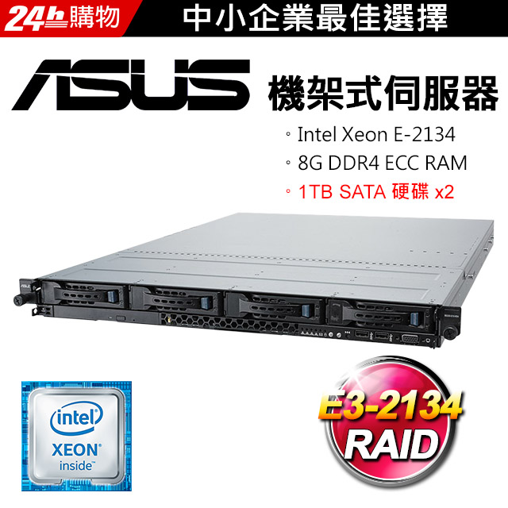
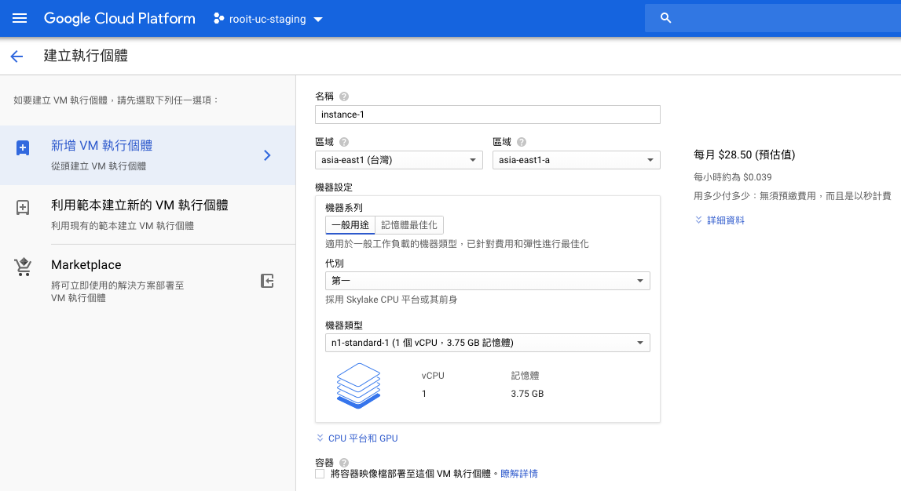

# DevOps 之時代的演進

隨著時代的演進，我們對於維運上的認知，不管從軟體或硬體上都有很大的轉變。

### old style 的做法

稍微有規模的軟體公司，通常都有一個職位叫 MIS，他的責任就是管理公司所有內、外的網路、主機服務狀態、子網域、防火牆、資料備援、甚至資料庫要安裝哪個版本。我只需要說：

我 (開發工程師)：哈囉布萊恩，我目前現在做的這個案子，需要一台 VM 當測試環境，規格是硬碟 40G，記憶體 4G，作業系統要安裝 CentOS 的，軟體的部分需要 MySQL、Tomcat、JDK 的第幾版，對外 port 要開 3306 跟 80。還需要一台 VM 是 Production 環境，硬碟跟記憶體要多兩倍，大概什麼時候可以弄好。(開發者們只要出一張嘴，現在想想好羞愧，哈哈哈)。

布萊恩 (MIS)：我手邊還有三台機器要安裝，週五才能給你，而且最近很多案子都在跑，我們現在的記憶已經不太夠了，需要再買新的 RAM 來加，目前測試機只能割 2G 記憶體給你，應該還夠用吧。

### cloud 時代的做法

大多數的 10 人以下的新創公司，都沒有 MIS 這個職位，也不需要一開始就花大錢買昂貴伺服器，取而代之的是在 AWS、GCP、Azure 的平台，註冊一個帳號，把老闆的信用卡卡號填下去，點選「Compute Engine」頁籤，挑選想要的規格，並選擇月繳方案，按下「建立」按鈕。看著 loading 畫面轉轉轉，直到出現綠燈，然後再點到「AMI」頁籤，下載自動產生的預設伺服器權限鑰匙，然後你就有一台測試機了，是不是快到有點懷疑人生，很慶幸自己生對年代？

你會想說那 MIS 這個職位，不就消失被淘汰了？不，只是名字換了，變成 DevOps 工程師，他們要做的事又更多更廣了。在接下來的篇幅，將逐步介紹 cloud 時代的來臨，怎麼根本的改變了我們。

